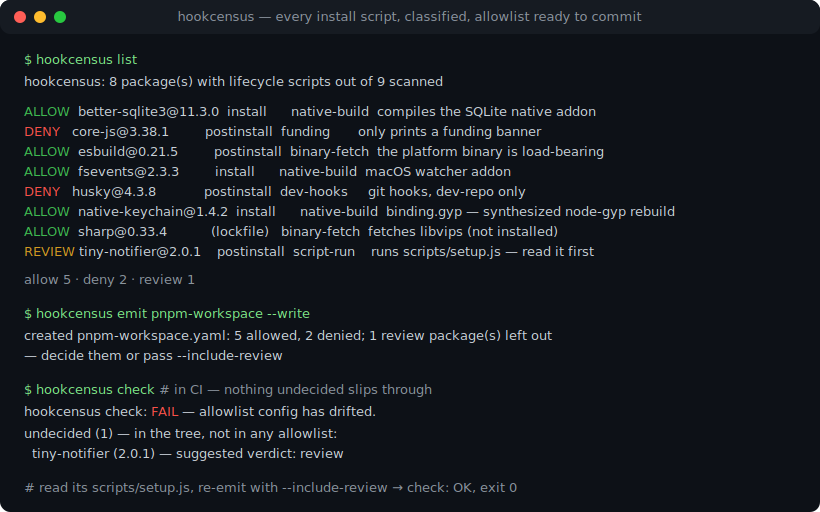
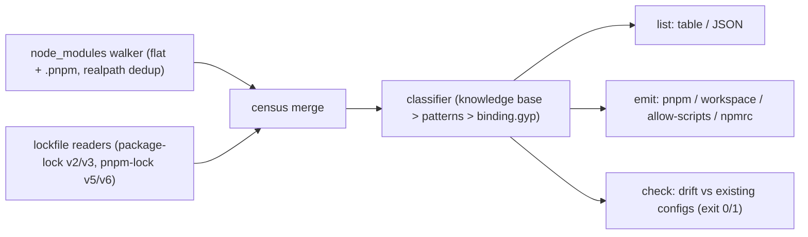

# hookcensus

[English](README.md) | [中文](README.zh.md) | [日本語](README.ja.md)

[](LICENSE)   [](CONTRIBUTING.md)

**依存ツリー内のすべてのライフサイクルスクリプトを列挙し、それぞれが何をするのか分類し、そのままコミットできる pnpm / npm の許可リスト設定を生成する、オープンソースのゼロ依存 CLI。**



```bash
# not yet on npm — install from a checkout of this repository
npm install && npm run build && npm pack
npm install -g ./hookcensus-0.1.0.tgz
```

## なぜ hookcensus？

インストールスクリプトは npm ワーム攻撃の主戦力です。侵害されたリリースが `postinstall` をひとつ仕込むだけで、そのツリーをインストールする全マシンで実行されます。エコシステムの答え——pnpm 10 は依存のビルドスクリプトを既定でブロックし、npm プロジェクトには `ignore-scripts=true` が普及——は、そのリスクを新しい雑務に置き換えました。誰かがパッケージごとに何の実行を許すか決め、依存の入れ替わりに合わせてそのリストを維持し続けなければなりません。今日そのリストは手書きです。既存の補助ツールはあるパッケージのスクリプトを無視*できるか*だけを答え、スクリプトが*何をしているか*は教えず、設定も書いてくれず、新しい依存がフックを携えて静かに現れても CI を失敗させてくれません。hookcensus はループ全体を担います。両方のインストーラーレイアウトを走査し（ロックファイルのフラグも読むため、何もインストールする前から動作）、各スクリプトにカテゴリ・判定・一文の理由を与え、各パッケージマネージャが求める正確な設定を出力し、さらに国勢調査と許可リストが食い違った瞬間に終了コード 1 で知らせる `check` コマンドを備えます——両方向を検査します。期限切れの許可エントリもまた潜在的な穴だからです。

|  | hookcensus | can-i-ignore-scripts | @lavamoat/allow-scripts | pnpm approve-builds |
|---|---|---|---|---|
| 答えるもの | 各スクリプトが何をするか、理由つき | これは無視できる？ | 承認済みの集合だけ実行 | 対話的な承認 |
| スクリプト単位の分類 | 8 カテゴリ・3 判定・安定した理由文 | 既知リストの照合 | なし | なし |
| コミット可能な設定の出力 | pnpm、pnpm-workspace、allow-scripts、.npmrc | なし | 自前形式のみ | pnpm のみ |
| 暗黙の binding.gyp ビルド | 検出し、合成されるコマンドとして表示 | なし | あり | あり |
| CI ドリフト検査（未決定も期限切れも） | `check`、終了コード 1、`--format json` | なし | 部分的 | なし |
| ロックファイルだけで動作 | はい（npm v2/v3、pnpm v5/v6 のフラグ） | はい | いいえ、node_modules が必要 | いいえ、インストールが必要 |
| ランタイム依存 | 0 | 複数 | 複数 | pnpm に同梱 |

<sub>各行の能力は各プロジェクトの公開ドキュメントと npm メタデータで確認、2026-07。pnpm ロックファイル v9 はパッケージ単位のビルドフラグを持たなくなりました。hookcensus はその旨を明示し、代わりにインストール済みツリーを走査します。</sub>

## 特徴

- **標本ではなく全数調査** — npm/yarn のフラットレイアウトと pnpm の `.pnpm` ストア（realpath でシンボリックリンクを重複排除）を走査し、入れ子のバージョンにも再帰し、誰も宣言しないスクリプトまで捕捉します：install スクリプトなしの `binding.gyp` に対し、パッケージマネージャは `node-gyp rebuild` を合成します。
- **インストール前から使える** — `package-lock.json`/`npm-shrinkwrap.json` v2/v3 の `hasInstallScript` と `pnpm-lock.yaml` v5/v6 の `requiresBuild` フラグがロックファイル単体から調査を起こすため、最初の `install` を走らせる前に許可リストを決められます。
- **根拠つきの分類** — 各エントリはカテゴリ（native-build、binary-fetch、dev-hooks、funding、patch、trivial、script-run、unknown）、判定（allow/deny/review）、一文の理由を持ちます。厳選 25 パッケージのナレッジベースが両方向でコマンドパターンを上書きします（[docs/classification.md](docs/classification.md)）。
- **そのままコミットできる設定を 4 ターゲットで** — package.json または pnpm-workspace.yaml 向けの `pnpm.onlyBuiltDependencies` + `ignoredBuiltDependencies`、npm 向けに @lavamoat/allow-scripts が使う `lavamoat.allowScripts`、そして `.npmrc` の `ignore-scripts=true`。`--write` は既存ファイルを潰さずマージします（[docs/allowlist-formats.md](docs/allowlist-formats.md)）。
- **allow 方向には決して推測しない** — パターンマッチで `allow` になるのはネイティブビルドのツールチェーンだけ。不確かなものはすべて `review` となり、実際にレビューした上で `--include-review` を渡さない限り出力される許可リストに入りません。
- **CI のためのドリフト検査** — フックを持つパッケージが未決定のとき、*または*設定済みの名前が期限切れになったとき、`hookcensus check` は終了コード 1 で失敗し、スクリプト向けに `--format json` を提供します。終了コードはドリフト（1）と使い方の誤り（2）を区別します。
- **ランタイム依存ゼロ、完全オフライン** — 必要なのは Node.js だけ。YAML サブセットリーダー、ロックファイルパーサー、ウォーカーはすべてリポジトリ内実装で、ツールがソケットを開くことは一切ありません。

## クイックスタート

インストール：

```bash
# not yet on npm — install from a checkout of this repository
npm install && npm run build && npm pack
npm install -g ./hookcensus-0.1.0.tgz
```

同梱のサンプルプロジェクトを調査します：

```bash
node scripts/setup-examples.mjs   # materialize the examples' committed fixture trees
hookcensus list examples/webapp
```

出力（実際にキャプチャした実行結果）：

```text
hookcensus: 8 package(s) with lifecycle scripts out of 9 scanned
lockfiles read: package-lock.json

ALLOW   better-sqlite3@11.3.0  install      native-build  fetches or compiles the SQLite native addon; the module cannot load without it
DENY    core-js@3.38.1         postinstall  funding       the postinstall only prints a funding banner; polyfills work identically without it
ALLOW   esbuild@0.21.5         postinstall  binary-fetch  puts the platform esbuild binary in place; the JS API shells out to it for every build
ALLOW   fsevents@2.3.3         install      native-build  macOS file-watching addon (binding.gyp); watch tooling degrades to polling without it
DENY    husky@4.3.8            postinstall  dev-hooks     installs git hooks — meaningful only inside husky's own checkout, never as your dependency
ALLOW   native-keychain@1.4.2  install      native-build  ships a binding.gyp with no install script — package managers synthesize `node-gyp rebuild`
ALLOW   sharp@0.33.4           (lockfile)   binary-fetch  fetches the prebuilt libvips binary (or builds from source); image ops need it (not installed)
REVIEW  tiny-notifier@2.0.1    postinstall  script-run    runs a bundled script (scripts/setup.js); read it before allowing

allow 5 · deny 2 · review 1

note: the root project (webapp) declares postinstall — pnpm's allowlist never gates root scripts, but npm's ignore-scripts=true blocks them too.
```

調査結果を設定へ——pnpm 10 向けに、そのまま pnpm-workspace.yaml の形で（実際にキャプチャした実行結果）：

```bash
hookcensus emit pnpm-workspace examples/webapp
```

```text
onlyBuiltDependencies:
  - better-sqlite3
  - esbuild
  - fsevents
  - native-keychain
  - sharp
ignoredBuiltDependencies:
  - core-js
  - husky
```

`tiny-notifier` は意図的に不在です。判定が *review* であり、review が黙って許可リストに入ることはありません（stderr が知らせます。`scripts/setup.js` を読んだ上で `--include-review` を追加してください）。そして CI で正直さを保ちます——2 つ目の同梱サンプルには数か月前に書かれた許可リストがあります（実際にキャプチャした実行結果、終了コード 1）：

```bash
hookcensus check examples/pnpm-app
```

```text
hookcensus check: FAIL — allowlist config has drifted.

undecided (2) — in the tree, not in any allowlist:
  better-sqlite3 (11.3.0) — suggested verdict: allow
  node-sass (9.0.0) — suggested verdict: allow

stale (1) — configured, but no longer has scripts in this tree:
  left-pad
```

## 判定

| 判定 | 意味 | 出力設定での扱い |
|---|---|---|
| `allow` | スクリプトなしではパッケージが壊れる（ネイティブアドオン、必須バイナリ） | 許可リスト（`onlyBuiltDependencies`、`allowScripts: true`） |
| `deny` | 利用者には何もしないスクリプト（git フック、寄付バナー、単なる echo） | 拒否リスト（`ignoredBuiltDependencies`、`allowScripts: false`） |
| `review` | 不透明なスクリプト、ネットワークアクセス、patch-package、ロックファイルのみの目撃 | `--include-review` を渡すまで除外 |

## CLI リファレンス

`hookcensus list [dir]` は調査結果を表示。`hookcensus emit <target> [dir]` は `pnpm`・`pnpm-workspace`・`allow-scripts`・`npmrc` 向けの設定を描画。`hookcensus check [dir]` は調査結果を発見したすべての許可リスト設定と突き合わせ、ドリフトを報告します。

| フラグ | 既定値 | 効果 |
|---|---|---|
| `--format text\|json` | `text` | `list` と `check` の出力形式。JSON の構造は CI 向けに安定 |
| `--include-review` | オフ | `emit`：review 判定を allow として扱う——実際にレビューした後に |
| `--write` | オフ | `emit`：表示する代わりに設定をプロジェクトファイルへマージ |

終了コード：`0` クリーン、`1` ドリフト検出（`check` のみ）、`2` 使い方または I/O エラー——スクリプトは怪しいツリーと壊れた呼び出しを区別できます。

## アーキテクチャ



## ロードマップ

- [x] 二重レイアウトのウォーカー、ロックファイルからのシード、ナレッジベース付き 8 カテゴリ分類器、`--write` マージ対応の 4 出力ターゲット、ドリフト検査 CI ゲート（v0.1.0）
- [ ] `yarn.lock` と `bun.lock` のリーダー
- [ ] `--diff` モード：ロックファイル 2 リビジョン間の調査差分、PR レビュー用
- [ ] スクリプトのピン留め：許可済みスクリプトのハッシュを記録し、更新で書き換わったら review を再発火
- [ ] コミュニティから寄せられた理由でナレッジベースを拡充

全リストは [open issues](https://github.com/JaydenCJ/hookcensus/issues) を参照してください。

## コントリビュート

コントリビュート歓迎です。`npm install && npm run build` でビルドし、`npm test`（90 テスト）と `bash scripts/smoke.sh`（`SMOKE OK` を出力すること）を実行してください——このリポジトリは CI を同梱せず、上記の主張はすべてローカル実行で検証されています。[CONTRIBUTING.md](CONTRIBUTING.md) を読み、[good first issue](https://github.com/JaydenCJ/hookcensus/issues?q=is%3Aissue+is%3Aopen+label%3A%22good+first+issue%22) を選ぶか、[ディスカッション](https://github.com/JaydenCJ/hookcensus/discussions)を始めてください。

## ライセンス

[MIT](LICENSE)
