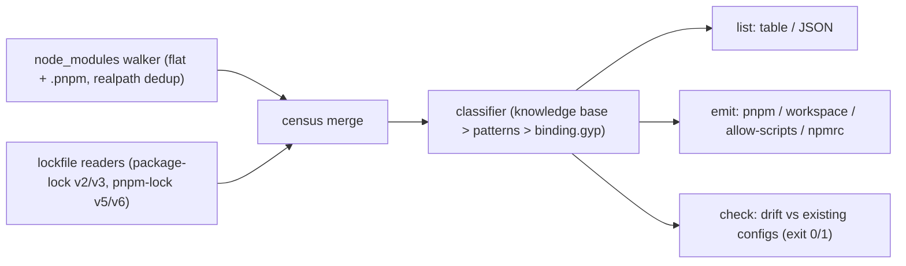

# hookcensus

[English](README.md) | [中文](README.zh.md) | [日本語](README.ja.md)

[](LICENSE)   [](CONTRIBUTING.md)

**An open-source, zero-dependency CLI that lists every lifecycle script in your dependency tree, classifies what each one does, and generates ready-to-commit pnpm and npm allowlist configs.**


```bash
# not yet on npm — install from a checkout of this repository
npm install && npm run build && npm pack
npm install -g ./hookcensus-0.1.0.tgz
```

## Why hookcensus?

Install scripts are the workhorse of npm worm attacks: one compromised release adds a `postinstall`, and it executes on every machine that installs the tree. The ecosystem's answer — pnpm 10 blocks dependency build scripts by default, npm projects adopt `ignore-scripts=true` — trades that risk for a new chore: somebody has to decide, package by package, what is actually allowed to run, and keep that list current as dependencies churn. Today that list is hand-written. Existing helpers tell you *whether* a package's scripts can be ignored; none of them tell you *what the script does*, none of them write the config, and none of them fail your CI when a new dependency quietly shows up with a hook. hookcensus does the whole loop: it walks both installer layouts (and reads lockfile flags, so it works before anything is installed), classifies every script with a category, a verdict and a one-sentence reason, emits the exact config each package manager wants, and ships a `check` command that exits 1 the moment the census and your allowlist disagree — in either direction, because a stale allow entry is a latent hole too.

|  | hookcensus | can-i-ignore-scripts | @lavamoat/allow-scripts | pnpm approve-builds |
|---|---|---|---|---|
| Answers | what each script does, with a reason | can this be ignored? | runs the approved set | interactive approval |
| Per-script classification | 8 categories, 3 verdicts, stable reasons | known-list lookup | no | no |
| Emits ready-to-commit config | pnpm, pnpm-workspace, allow-scripts, .npmrc | no | its own format only | pnpm only |
| Implicit binding.gyp builds | detected and shown as the synthesized command | no | yes | yes |
| CI drift gate (undecided AND stale) | `check`, exit 1, `--format json` | no | partial | no |
| Works from lockfile alone | yes (npm v2/v3, pnpm v5/v6 flags) | yes | no, needs node_modules | no, needs install |
| Runtime dependencies | 0 | several | several | ships inside pnpm |

<sub>Capability rows checked against each project's public docs and npm metadata, 2026-07. pnpm lockfile v9 no longer carries per-package build flags; hookcensus says so and scans the installed tree instead.</sub>

## Features

- **A complete census, not a sample** — walks flat npm/yarn layouts and pnpm's `.pnpm` store (symlink-deduped via realpath), recurses into nested versions, and catches the script nobody declares: a `binding.gyp` with no install script, for which package managers synthesize `node-gyp rebuild`.
- **Works before you install** — `package-lock.json`/`npm-shrinkwrap.json` v2/v3 `hasInstallScript` and `pnpm-lock.yaml` v5/v6 `requiresBuild` flags seed the census from the lockfile alone, so you can decide the allowlist before the first `install` ever runs.
- **Classification with receipts** — every entry gets a category (native-build, binary-fetch, dev-hooks, funding, patch, trivial, script-run, unknown), a verdict (allow/deny/review) and a one-sentence reason; a curated 25-package knowledge base overrides command patterns in both directions ([docs/classification.md](docs/classification.md)).
- **Ready-to-commit configs, four targets** — `pnpm.onlyBuiltDependencies` + `ignoredBuiltDependencies` for package.json or pnpm-workspace.yaml, `lavamoat.allowScripts` for npm via @lavamoat/allow-scripts, and `.npmrc` `ignore-scripts=true`; `--write` merges into existing files instead of clobbering them ([docs/allowlist-formats.md](docs/allowlist-formats.md)).
- **Never guesses in the allow direction** — only native build toolchains pattern-match to `allow`; everything uncertain is `review` and stays out of emitted allowlists unless you pass `--include-review` after actually reviewing.
- **A CI gate for drift** — `hookcensus check` exits 1 when a package with hooks is undecided *or* when a configured name has gone stale, with `--format json` for scripting; exit codes separate drift (1) from usage errors (2).
- **Zero runtime dependencies, fully offline** — Node.js is the only requirement; the YAML subset reader, lockfile parsers and walkers are all in-repo, and the tool never opens a socket.

## Quickstart

Install:

```bash
# not yet on npm — install from a checkout of this repository
npm install && npm run build && npm pack
npm install -g ./hookcensus-0.1.0.tgz
```

Take the census of the bundled example project:

```bash
node scripts/setup-examples.mjs   # materialize the examples' committed fixture trees
hookcensus list examples/webapp
```

Output (real captured run):

```text
hookcensus: 8 package(s) with lifecycle scripts out of 9 scanned
lockfiles read: package-lock.json

ALLOW   better-sqlite3@11.3.0  install      native-build  fetches or compiles the SQLite native addon; the module cannot load without it
DENY    core-js@3.38.1         postinstall  funding       the postinstall only prints a funding banner; polyfills work identically without it
ALLOW   esbuild@0.21.5         postinstall  binary-fetch  puts the platform esbuild binary in place; the JS API shells out to it for every build
ALLOW   fsevents@2.3.3         install      native-build  macOS file-watching addon (binding.gyp); watch tooling degrades to polling without it
DENY    husky@4.3.8            postinstall  dev-hooks     installs git hooks — meaningful only inside husky's own checkout, never as your dependency
ALLOW   native-keychain@1.4.2  install      native-build  ships a binding.gyp with no install script — package managers synthesize `node-gyp rebuild`
ALLOW   sharp@0.33.4           (lockfile)   binary-fetch  fetches the prebuilt libvips binary (or builds from source); image ops need it (not installed)
REVIEW  tiny-notifier@2.0.1    postinstall  script-run    runs a bundled script (scripts/setup.js); read it before allowing

allow 5 · deny 2 · review 1

note: the root project (webapp) declares postinstall — pnpm's allowlist never gates root scripts, but npm's ignore-scripts=true blocks them too.
```

Turn the census into config — for pnpm 10, straight into pnpm-workspace.yaml (real captured run):

```bash
hookcensus emit pnpm-workspace examples/webapp
```

```text
onlyBuiltDependencies:
  - better-sqlite3
  - esbuild
  - fsevents
  - native-keychain
  - sharp
ignoredBuiltDependencies:
  - core-js
  - husky
```

`tiny-notifier` is deliberately missing: its verdict is *review*, and reviews never enter an allowlist silently (stderr says so; add `--include-review` once you have read its `scripts/setup.js`). Then keep it honest in CI — the second bundled example has an allowlist written months ago (real captured run, exit code 1):

```bash
hookcensus check examples/pnpm-app
```

```text
hookcensus check: FAIL — allowlist config has drifted.

undecided (2) — in the tree, not in any allowlist:
  better-sqlite3 (11.3.0) — suggested verdict: allow
  node-sass (9.0.0) — suggested verdict: allow

stale (1) — configured, but no longer has scripts in this tree:
  left-pad
```

## Verdicts

| Verdict | Meaning | In emitted config |
|---|---|---|
| `allow` | the package is broken without its script (native addon, load-bearing binary) | allowlist (`onlyBuiltDependencies`, `allowScripts: true`) |
| `deny` | the script does nothing for consumers (git hooks, funding banners, bare echo) | deny list (`ignoredBuiltDependencies`, `allowScripts: false`) |
| `review` | opaque script, network reach, patch-package, or lockfile-only sighting | excluded until `--include-review` |

## CLI reference

`hookcensus list [dir]` prints the census; `hookcensus emit <target> [dir]` renders config for `pnpm`, `pnpm-workspace`, `allow-scripts` or `npmrc`; `hookcensus check [dir]` compares the census against every allowlist config found and reports drift.

| Flag | Default | Effect |
|---|---|---|
| `--format text\|json` | `text` | output format for `list` and `check`; the JSON shape is stable for CI |
| `--include-review` | off | `emit`: treat review verdicts as allow — for after you have reviewed them |
| `--write` | off | `emit`: merge the config into the project file instead of printing |

Exit codes: `0` clean, `1` drift found (`check` only), `2` usage or I/O error — so scripts can tell a compromised-looking tree from a broken invocation.

## Architecture



## Roadmap

- [x] Dual-layout walker, lockfile seeding, 8-category classifier with knowledge base, four emit targets with `--write` merge, drift-checking CI gate (v0.1.0)
- [ ] `yarn.lock` and `bun.lock` readers
- [ ] `--diff` mode: census delta between two lockfile revisions, for PR review
- [ ] Script pinning: record a hash of each allowed script so an update that edits it re-triggers review
- [ ] Grow the knowledge base from community-submitted reasons

See the [open issues](https://github.com/JaydenCJ/hookcensus/issues) for the full list.

## Contributing

Contributions are welcome. Build with `npm install && npm run build`, then run `npm test` (90 tests) and `bash scripts/smoke.sh` (must print `SMOKE OK`) — this repository ships no CI, every claim above is verified by local runs. See [CONTRIBUTING.md](CONTRIBUTING.md), grab a [good first issue](https://github.com/JaydenCJ/hookcensus/issues?q=is%3Aissue+is%3Aopen+label%3A%22good+first+issue%22), or start a [discussion](https://github.com/JaydenCJ/hookcensus/discussions).

## License

[MIT](LICENSE)
