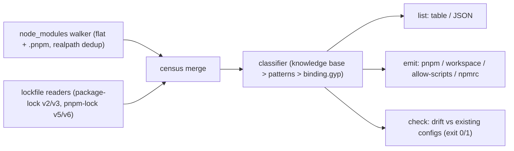

# hookcensus

[English](README.md) | [中文](README.zh.md) | [日本語](README.ja.md)

[](LICENSE)   [](CONTRIBUTING.md)

**开源、零依赖的 CLI：列出依赖树中的每一个生命周期脚本，逐个分类说明它在做什么，并生成可直接提交的 pnpm 与 npm 允许清单配置。**


```bash
# not yet on npm — install from a checkout of this repository
npm install && npm run build && npm pack
npm install -g ./hookcensus-0.1.0.tgz
```

## 为什么选 hookcensus？

安装脚本是 npm 蠕虫攻击的主力载体：一次被投毒的发布加上一个 `postinstall`，就会在每台安装这棵树的机器上执行。生态的应对——pnpm 10 默认拦截依赖的构建脚本、npm 项目普及 `ignore-scripts=true`——把风险换成了一件新差事：必须有人逐包决定到底允许什么运行，并随着依赖的更迭持续维护这份清单。今天这份清单全靠手写。现有辅助工具只回答某个包的脚本*能不能*忽略；没有一个告诉你*脚本在做什么*，没有一个替你写配置，也没有一个会在新依赖悄悄带着钩子出现时让 CI 失败。hookcensus 打通了整个闭环：同时遍历两种安装器布局（并读取锁文件标记，因此装包之前就能工作），为每个脚本给出类别、裁定和一句话理由，输出各包管理器想要的确切配置，还附带一个 `check` 命令——一旦普查与允许清单不一致就以退出码 1 报警，两个方向都查，因为过期的允许条目同样是潜在的漏洞。

|  | hookcensus | can-i-ignore-scripts | @lavamoat/allow-scripts | pnpm approve-builds |
|---|---|---|---|---|
| 回答的问题 | 每个脚本在做什么，附理由 | 这个能忽略吗？ | 只运行已批准的集合 | 交互式批准 |
| 逐脚本分类 | 8 个类别、3 种裁定、稳定的理由文案 | 已知清单查表 | 无 | 无 |
| 输出可直接提交的配置 | pnpm、pnpm-workspace、allow-scripts、.npmrc | 无 | 仅自有格式 | 仅 pnpm |
| 隐式 binding.gyp 构建 | 检出并展示合成出的命令 | 无 | 有 | 有 |
| CI 漂移门禁（未决且过期都查） | `check`，退出码 1，`--format json` | 无 | 部分 | 无 |
| 仅凭锁文件即可工作 | 是（npm v2/v3、pnpm v5/v6 标记） | 是 | 否，需要 node_modules | 否，需要先安装 |
| 运行时依赖 | 0 | 若干 | 若干 | 内置于 pnpm |

<sub>能力对比各行依据各项目公开文档与 npm 元数据核对，2026-07。pnpm 锁文件 v9 已不再携带逐包构建标记；hookcensus 会明确说明，并改为扫描已安装的树。</sub>

## 特性

- **完整普查，而非抽样** — 遍历 npm/yarn 的扁平布局与 pnpm 的 `.pnpm` 仓库（经 realpath 去重符号链接），递归进入嵌套版本，还能抓住没人声明的那个脚本：只有 `binding.gyp` 而无 install 脚本时，包管理器会合成 `node-gyp rebuild`。
- **装包之前就能用** — `package-lock.json`/`npm-shrinkwrap.json` v2/v3 的 `hasInstallScript` 与 `pnpm-lock.yaml` v5/v6 的 `requiresBuild` 标记可以仅凭锁文件生成普查，让你在第一次 `install` 之前就把允许清单定下来。
- **有凭据的分类** — 每个条目都有类别（native-build、binary-fetch、dev-hooks、funding、patch、trivial、script-run、unknown）、裁定（allow/deny/review）和一句话理由；精选的 25 包知识库可在两个方向上覆盖命令模式（[docs/classification.md](docs/classification.md)）。
- **可直接提交的配置，四种目标** — 面向 package.json 或 pnpm-workspace.yaml 的 `pnpm.onlyBuiltDependencies` + `ignoredBuiltDependencies`、面向 npm 经 @lavamoat/allow-scripts 使用的 `lavamoat.allowScripts`、以及 `.npmrc` 的 `ignore-scripts=true`；`--write` 会合并进现有文件而不是覆盖它们（[docs/allowlist-formats.md](docs/allowlist-formats.md)）。
- **绝不朝 allow 方向猜测** — 只有原生构建工具链会被模式匹配为 `allow`；一切不确定的都是 `review`，且除非你在真正审阅之后传入 `--include-review`，否则不会进入输出的允许清单。
- **CI 漂移门禁** — 当带钩子的包尚未被裁定、*或者*已配置的名字已经过期时，`hookcensus check` 以退出码 1 失败，并提供 `--format json` 供脚本使用；退出码把漂移（1）与用法错误（2）区分开来。
- **零运行时依赖，完全离线** — 仅需 Node.js；YAML 子集读取器、锁文件解析器与遍历器全部在仓库内实现，工具从不打开任何套接字。

## 快速上手

安装：

```bash
# not yet on npm — install from a checkout of this repository
npm install && npm run build && npm pack
npm install -g ./hookcensus-0.1.0.tgz
```

对内置示例项目做一次普查：

```bash
node scripts/setup-examples.mjs   # materialize the examples' committed fixture trees
hookcensus list examples/webapp
```

输出（真实捕获的运行结果）：

```text
hookcensus: 8 package(s) with lifecycle scripts out of 9 scanned
lockfiles read: package-lock.json

ALLOW   better-sqlite3@11.3.0  install      native-build  fetches or compiles the SQLite native addon; the module cannot load without it
DENY    core-js@3.38.1         postinstall  funding       the postinstall only prints a funding banner; polyfills work identically without it
ALLOW   esbuild@0.21.5         postinstall  binary-fetch  puts the platform esbuild binary in place; the JS API shells out to it for every build
ALLOW   fsevents@2.3.3         install      native-build  macOS file-watching addon (binding.gyp); watch tooling degrades to polling without it
DENY    husky@4.3.8            postinstall  dev-hooks     installs git hooks — meaningful only inside husky's own checkout, never as your dependency
ALLOW   native-keychain@1.4.2  install      native-build  ships a binding.gyp with no install script — package managers synthesize `node-gyp rebuild`
ALLOW   sharp@0.33.4           (lockfile)   binary-fetch  fetches the prebuilt libvips binary (or builds from source); image ops need it (not installed)
REVIEW  tiny-notifier@2.0.1    postinstall  script-run    runs a bundled script (scripts/setup.js); read it before allowing

allow 5 · deny 2 · review 1

note: the root project (webapp) declares postinstall — pnpm's allowlist never gates root scripts, but npm's ignore-scripts=true blocks them too.
```

把普查转成配置——面向 pnpm 10，直接写成 pnpm-workspace.yaml 的形式（真实捕获的运行结果）：

```bash
hookcensus emit pnpm-workspace examples/webapp
```

```text
onlyBuiltDependencies:
  - better-sqlite3
  - esbuild
  - fsevents
  - native-keychain
  - sharp
ignoredBuiltDependencies:
  - core-js
  - husky
```

`tiny-notifier` 是有意缺席的：它的裁定是 *review*，而 review 永远不会悄悄进入允许清单（stderr 会说明；读完它的 `scripts/setup.js` 之后再加 `--include-review`）。然后在 CI 里持续把关——第二个内置示例带着一份几个月前写下的允许清单（真实捕获的运行结果，退出码 1）：

```bash
hookcensus check examples/pnpm-app
```

```text
hookcensus check: FAIL — allowlist config has drifted.

undecided (2) — in the tree, not in any allowlist:
  better-sqlite3 (11.3.0) — suggested verdict: allow
  node-sass (9.0.0) — suggested verdict: allow

stale (1) — configured, but no longer has scripts in this tree:
  left-pad
```

## 裁定

| 裁定 | 含义 | 在输出配置中的去向 |
|---|---|---|
| `allow` | 没有该脚本包就是坏的（原生扩展、承重的二进制） | 允许清单（`onlyBuiltDependencies`、`allowScripts: true`） |
| `deny` | 脚本对使用者毫无作用（git 钩子、捐助横幅、单纯 echo） | 拒绝清单（`ignoredBuiltDependencies`、`allowScripts: false`） |
| `review` | 不透明脚本、触网行为、patch-package、或仅见于锁文件 | 排除在外，直到传入 `--include-review` |

## CLI 参考

`hookcensus list [dir]` 打印普查；`hookcensus emit <target> [dir]` 为 `pnpm`、`pnpm-workspace`、`allow-scripts` 或 `npmrc` 渲染配置；`hookcensus check [dir]` 把普查与找到的每一份允许清单配置对照并报告漂移。

| 选项 | 默认值 | 效果 |
|---|---|---|
| `--format text\|json` | `text` | `list` 与 `check` 的输出格式；JSON 结构对 CI 保持稳定 |
| `--include-review` | 关 | `emit`：把 review 裁定当作 allow——用于你确实审阅之后 |
| `--write` | 关 | `emit`：把配置合并进项目文件而不是打印 |

退出码：`0` 干净、`1` 发现漂移（仅 `check`）、`2` 用法或 I/O 错误——脚本因此能区分可疑的依赖树和写错的命令行。

## 架构



## 路线图

- [x] 双布局遍历器、锁文件播种、带知识库的 8 类别分类器、四种带 `--write` 合并的输出目标、漂移检查 CI 门禁（v0.1.0）
- [ ] `yarn.lock` 与 `bun.lock` 读取器
- [ ] `--diff` 模式：两个锁文件版本之间的普查差异，用于 PR 评审
- [ ] 脚本锁定：记录每个已允许脚本的哈希，脚本一旦被更新修改就重新触发 review
- [ ] 依靠社区提交的理由持续扩充知识库

完整列表见[开放 issue](https://github.com/JaydenCJ/hookcensus/issues)。

## 参与贡献

欢迎贡献。先 `npm install && npm run build` 构建，然后运行 `npm test`（90 个测试）与 `bash scripts/smoke.sh`（必须打印 `SMOKE OK`）——本仓库不附带 CI，以上每一条主张都由本地运行验证。请参阅 [CONTRIBUTING.md](CONTRIBUTING.md)，认领一个 [good first issue](https://github.com/JaydenCJ/hookcensus/issues?q=is%3Aissue+is%3Aopen+label%3A%22good+first+issue%22)，或发起一次[讨论](https://github.com/JaydenCJ/hookcensus/discussions)。

## 许可证

[MIT](LICENSE)
